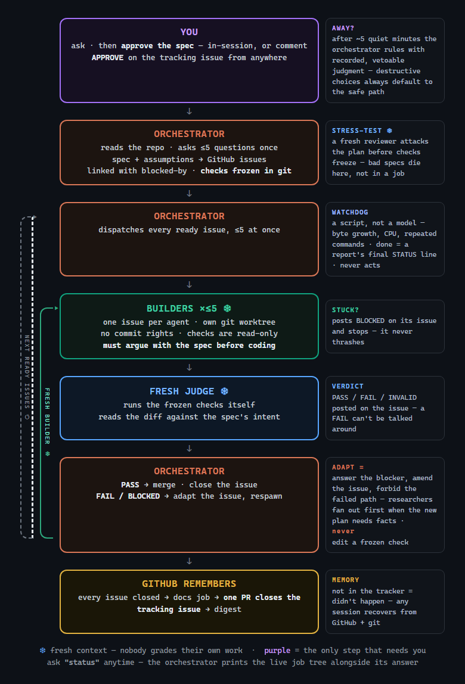
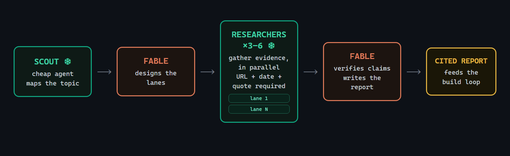

# architect-loop

**A research and software-engineering factory with the best practices built
in.** You describe what you want; the model you're already talking to — the
**orchestrator** — writes a spec, you approve it once, and the factory takes
it from there: the spec becomes GitHub issues, fresh builder agents build
them in parallel, an independent judge verifies every result against checks
that were frozen before any code existed, and error correction is built in —
stuck builders are answered and relaunched, failures are diagnosed and
retried with fixed inputs, and nothing merges over a failing verdict.
Research works the same way: parallel researchers gather evidence under hard
budgets, and every load-bearing claim is double-checked against its sources
before it can enter the report.

Ask for work. Come back when it's done.

## Install (30 seconds)

```bash
git clone https://github.com/DanMcInerney/architect-loop
cd architect-loop && ./install.sh        # Windows: .\install.ps1
npm i -g @openai/codex@latest            # optional: Codex CLI (>= 0.133)
```

One installer, both ecosystems: the same skills land in Claude Code and in
Codex's `.agents/skills`, so the commands work in whichever you open. Use
`--project` (`-Project` on Windows) to install into the current repo only.
You need [Claude Code](https://claude.com/claude-code) on any paid plan; the
Codex CLI on a ChatGPT plan is optional but recommended — builders default
to it. No API keys.

## Use

```
/architect                                      # the build factory
/architect-research <what you're considering>   # the research loop
```

That's the whole interface — no daemons, no extra windows. Your one job is
approving the spec: in-session, or by commenting `APPROVE` on the tracking
issue from your phone. If you're away, the factory waits about 5 minutes, then
uses the orchestrator's best judgment, records the ruling for after-the-fact
veto, and continues. Irreversible or destructive choices are the carve-out:
silence resolves to the non-destructive path, and `docs/STOP` stays absolute.
Everything else runs without you, and the run ends in a single PR plus a
digest of what shipped.

The build factory preconditions are per tracker mode. In GitHub mode, it
needs a GitHub repo: a remote, `gh auth status` passing, and `gh` ≥ 2.94.0
(native sub-issue and blocked-by flags). In markdown mode, it needs only a
git repo; `gh` is not required, the remote is optional, and pushes are
push-if-remote-exists. Missing preconditions fail loudly for the selected
mode — there is no silent fallback to another tracker.

### GitLab or fully local? markdown mode

Community request: "I have some projects locally or on Gitlab, where Github
issues are not really feasible for me to be the core backbone of the
architect loop. I suggest keeping it agnostic."

```ini
tracker = markdown
```

Markdown mode keeps the factory in the repo: issues live in `docs/issues/`,
no `gh` is needed, the remote is optional, and finish means a ready factory
branch plus a digest and merge instructions instead of a PR.
Every rule, judge, check, and the status tree work identically.

## The two patterns

Both skills are the same shape: **one orchestrator that plans and judges,
many disposable agents that do the work, and evidence rules that make
self-deception mechanically hard.** Fresh context everywhere it matters —
an agent reviewing its own work in the same conversation measurably misses
more, so nobody here grades their own work.

### The build factory



Two loops, drawn as the rails: the gray loop cycles through **ready
issues** — every issue whose blockers are closed, up to five builders at
once — until the plan is done. The green loop is **error correction**: when
a builder gets stuck or a judge fails a result, the orchestrator adapts the
*issue* (answers the blocker, amends the instructions, forbids the failed
path) and launches a fresh builder — but never touches the frozen acceptance
checks, so recovery can't drift into moving the goalposts.

### The research loop



Gathering is parallel; synthesis never is. A scout maps the topic, the
orchestrator designs researcher assignments along the topic's own fault
lines, budgeted researchers gather findings in parallel, and the draft's
thin sections aim a targeted second wave. Verification is a separate pass —
every load-bearing claim needs two independent sources, and no citation
survives unless its URL was actually fetched. One author writes the report.

## Max detail

### /architect, step by step

1. **Intake.** The orchestrator reads the repo and asks at most ~5 questions
   in one batch — each must pass a materiality test (would the answer change
   the build or how it's validated?). Everything else becomes a recorded
   assumption you can veto. It writes the spec to `docs/spec/` and opens the
   tracking issue that carries the spec pointer and approval instructions.
2. **Spec approval — the only human step.** Approve in-session or comment
   `APPROVE` (or `APPROVE with edits: ...` / `REJECT ...`) on the tracking
   issue. A run can carry verbatim pre-approval from your invocation.
   Absent a human: wait about 5 minutes, rule with the orchestrator's best
   judgment, record the ruling for after-the-fact veto, and continue. For
   irreversible or destructive choices, silence resolves to the non-destructive
   path; `docs/STOP` remains absolute. The factory never infers a yes from
   earlier conversation.
3. **The plan.** The spec compiles into sub-issues — vertical slices with
   acceptance criteria, may-touch/must-not-touch file boundaries, and native
   blocked-by links. Issues scheduled in parallel share no files, schemas,
   or other mutable state. Each issue's acceptance checks are frozen in git
   under `docs/checks/` *before* any builder exists; a builder editing a
   check file fails automatically. Then a fresh adversarial reviewer
   **stress-tests the whole plan** — executing draft check commands,
   attacking criteria for contradictions and non-falsifiability — so bad
   specs die before they cost a build.
4. **The factory loop.** The orchestrator dispatches every ready issue (≤5
   builders, one issue each, own git worktree, no commit rights) and sleeps
   until an event:
   - **Builders must argue first.** Before coding, each builder states its
     plan and every disagreement with the spec, citing real files — silent
     compliance is a defect. Each ruling gets an explicit accept/reject.
   - **A deterministic watchdog** — a ~70-line script, not a model — sweeps
     for stalls (output-byte growth, process CPU, repeated-command tails)
     and exits with typed evidence. Done means the job report's final
     non-blank line starts with `STATUS:`. It never kills and never decides;
     the orchestrator rules on what it reports.
   - **Stuck builders stop instead of thrashing.** A blocker is posted on
     the issue; the orchestrator answers durably there and respawns a fresh
     builder with the answer in its starting context.
   - **A fresh judge owns every merge.** It reruns the frozen checks itself
     (builder claims are hearsay) and reads the diff against the spec's
     intent — passing checks with wrong code still fails. Verdicts land as
     issue comments: PASS / FAIL / INVALID. The orchestrator cannot overrule
     a FAIL.
   - **Failures fix inputs, not models.** First failure: diagnose from the
     judge's evidence, amend the issue, respawn at the same tier. Second:
     re-plan or escalate. A merge conflict means the plan was wrong — kill
     the job and re-slice, never hand-merge builder work. Oddity re-planning
     is orchestrator-owned and may fan out researchers before the orchestrator
     updates the plan, issues, and checks.
5. **Finish.** A docs job consumes the run's documentation debt and codifies
   reusable diagnoses into `docs/solutions/` (read back at the start of
   every future run). GitHub mode opens one PR that closes the tracking
   issue; markdown mode leaves the factory branch ready and appends the
   digest and merge instructions to the tracking issue file. The digest
   lists what shipped, what was skipped, and the evidence.

Hard stops — the factory halts and asks you — include `docs/STOP` (the kill
switch), irreversible actions, two consecutive killed jobs, scope growing
beyond the approved spec, and blockers that collide with an approved
assumption.

**Ask it how it's going.** During a run, any status-flavored question prints
the live status tree beside the prose answer. It is plain text, so it works
in every surface; color auto-disables when piped. The script is also directly
runnable from the repo root (`skills/architect/status.ps1` or
`skills/architect/status.sh`), or from elsewhere by passing `-RepoRoot`.

```text
factory/status-tree
orchestrator  running
watchdog      idle
✓ MERGED      status: skill wiring
◐ JUDGING     status: scripts contract
▣ REPORTED    status: docs closure
● BUILDING    status: validator
⊘ QUEUED      status: digest blocked by #46
○ READY       status: follow-up
```

**The tracker is the memory.** Specs and frozen checks live in git;
disagreements, blocker answers, verdicts, and the digest live in the
selected tracker: GitHub issue comments in GitHub mode, or git-tracked
`docs/issues/` markdown files in markdown mode. Not in the tracker = didn't
happen, and any later session can recover the run from git plus the selected
tracker.

**Models.** Zero-config: the orchestrator is whatever session you launched;
builders are codex-first (GPT-5.5 xhigh when the Codex CLI is installed,
Sonnet-high otherwise). Override in `.architect/config`:

```ini
orchestrator = claude/best
builders = codex/best:xhigh
when trivial mechanical edit -> claude/haiku:low # cheap exact patch
when broad ambiguous refactor -> codex/best:xhigh # deeper search and edit budget
```

Tiers are fixed when the plan is cut — a failed job never silently escalates
to a stronger model. High-stakes changes get a cross-family review when both
CLIs are installed, because same-family review shares blind spots.

### /architect-research, step by step

1. **Scout.** One cheap agent (~10 searches) maps the topic: canonical
   terminology, the load-bearing systems and papers, the named people, where
   experts disagree. Skipped for quick fact-finds and comparisons.
2. **Design.** The orchestrator turns the map into 3–6 researcher
   assignments — perspective-diverse, overlap-checked, each drawing tactics
   for its source class: citation snowballing for papers,
   dependents-not-stars for repos, production post-mortems, expert tracking.
3. **Gather, in parallel, under budgets.** Each researcher gets 10–25 tool
   calls and at most 5 subjects, and returns ≤~2,500 tokens of compact
   findings against a numbered source list. Every finding carries a URL, a
   date, and an exact quote; "NOT FOUND" is a first-class answer;
   researchers are forbidden from making recommendations.
4. **Draft as state.** The orchestrator sketches a skeleton report and marks
   each section SUPPORTED / THIN / EMPTY. Thin sections aim a targeted
   second wave (max 2 rounds) — never re-chasing what's already found.
   Expert-opinion researchers join in wave two, seeded by the names wave one
   surfaced.
5. **Verify, separately.** Load-bearing claims need ≥2 independent sources;
   the orchestrator runs adversarial falsification searches; citations are
   allowed only from URLs actually fetched this session, because even
   search-grounded agents fabricate 3–13% of URLs.
6. **One author writes.** Answer-first, decision-oriented, with open
   questions stated. The committed report is the handoff — it feeds
   `/architect`'s specs directly.

Research is a separate skill on purpose: fan-out costs ~15× chat-level
tokens, so it should be a deliberate act, not a side effect of building.

## What's in the box

| File | What it is |
|---|---|
| [DESIGN.md](DESIGN.md) | Every design choice with its cited evidence |
| [skills/architect/SKILL.md](skills/architect/SKILL.md) | The orchestrator role: intake, spec approval, factory loop, hard stops |
| [skills/architect/dispatch.md](skills/architect/dispatch.md) | Model aliases, issue conventions, builder/judge templates, watchdog dispatch, respawn rules |
| [skills/architect/loop.md](skills/architect/loop.md) | Factory event loop, watchdog protocol, failure ladder, safety rails |
| [skills/architect/watchdog.ps1](skills/architect/watchdog.ps1) / [watchdog.sh](skills/architect/watchdog.sh) | The deterministic stall watchdog (typed evidence exits) |
| [skills/architect/research.md](skills/architect/research.md) | Slice-scale inline fact-check fan-out inside the build loop |
| [skills/architect-research/SKILL.md](skills/architect-research/SKILL.md) | Research orchestration: scout → design → gather → verify → write |
| [skills/architect-research/tactics.md](skills/architect-research/tactics.md) | Source-class tactics library for researchers |
| `.claude/agents/architect-builder.md` / `architect-judge.md` | The shipped builder and judge agent definitions |
| [tests/validate_skills.py](tests/validate_skills.py) | Sanity suite: contracts, links, sizes — `uv run --no-project python tests/validate_skills.py` |

## FAQ

**Do I need API keys?** No. Claude Code runs on your Claude plan; the Codex
CLI on your ChatGPT plan.

**What does a run cost?** Orchestrator judgment is minutes of a frontier
model; building happens on the configured builder tier. A long multi-job run
is a meaningful fraction of a weekly plan quota — which is why nothing fans
out until the plan is approved and stress-tested.

**What if a builder wrecks something?** It can't reach a branch: builders
have no commit access, their file boundaries are checked after every job,
and broken worktrees are discarded and respawned from the frozen checks.

**Can I watch?** Yes. Everything runs inside your open session, and the
issue comments carry the durable progress trail — or just wait for the
digest.

**Desktop app caveat:** the Claude Code desktop app has had shell-tool grant
limitations for subagents. Desktop is fine for planning and reviewing; run
the full factory from a terminal.

**Gray-zone model routing (unverified):** Claude Code can be pointed at
z.ai's Anthropic-compatible GLM endpoint via `ANTHROPIC_BASE_URL` and
`ANTHROPIC_AUTH_TOKEN`. z.ai supports the route; Anthropic does not bless
non-Claude routing. Canary it with your own key before relying on it.

## Origin

The original idea came from [this X post by @jumperz](https://x.com/jumperz/status/2065454404623384859)
about using Fable with Codex subagents. I built architect-loop because I
couldn't find an easy way to run that pattern, and because the pattern gets
much stronger with a few operational rules: frozen checks, fresh review,
issue-backed coordination, and repo-resident evidence.

## License

MIT
