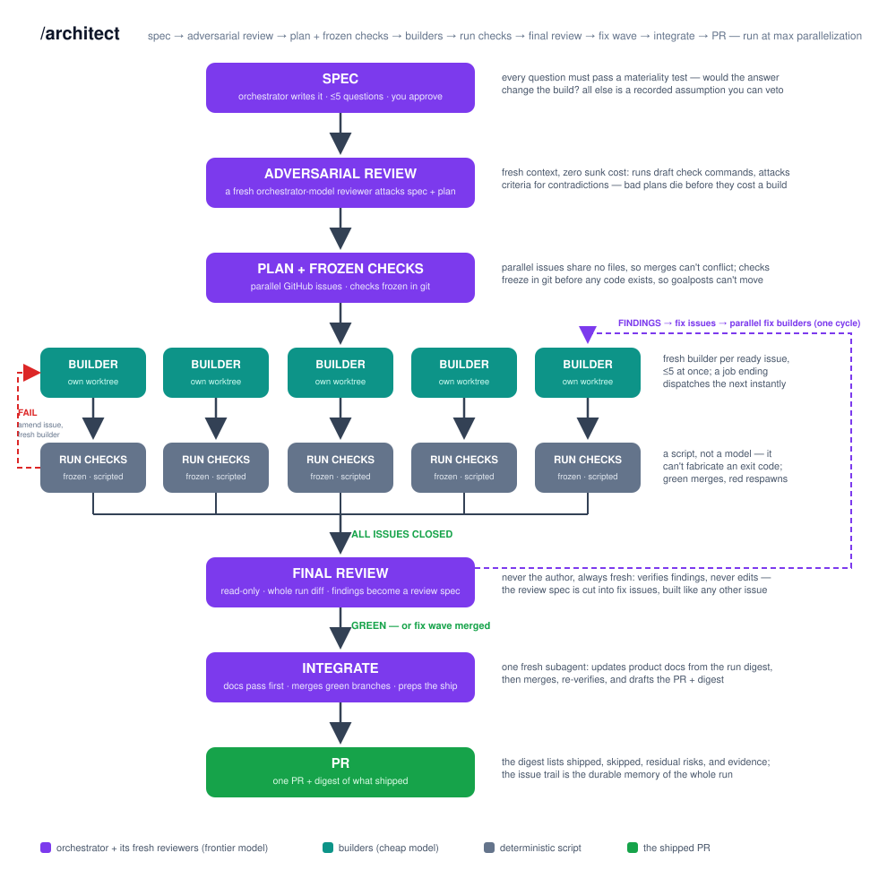
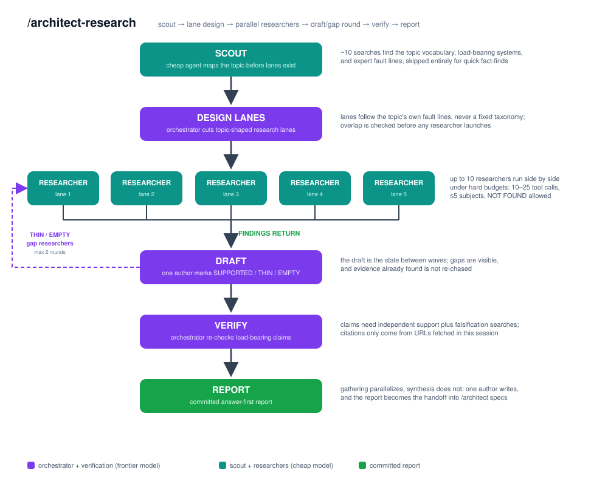

# architect-loop

**Set-it-and-forget-it research and software factory loop with best
practices built in. Save 80% of Fable token usage, lose no quality.**

## Usage

```
/architect-research <topic>
/architect <what you want>
```

Ask for work, come back when it's done. Your one job is approving the spec —
in-session, or by commenting `APPROVE` on the tracking issue from your phone.

## Installation

```bash
git clone https://github.com/DanMcInerney/architect-loop
cd architect-loop && ./install.sh        # Windows: .\install.ps1
npm i -g @openai/codex@latest            # optional: Codex CLI (>= 0.133)
```

One installer, both ecosystems: the same skills land in Claude Code and in
Codex's `.agents/skills`. You need [Claude Code](https://claude.com/claude-code)
on any paid plan; the Codex CLI on a ChatGPT plan is optional but recommended —
builders default to it. No API keys.

## Design

A configurable **orchestrator** model (default: Fable, high) designs,
assigns, and reviews. A configurable **builder** model (default: Codex
GPT-5.5, xhigh) does the heavy lifting. Both are overridable — see
[Config](#config).

### /architect



- Each stage is its own small skill, invoked in order: `codebase-design`
  (shared vocabulary), `to-spec`, `adversarial-review`, `to-issues`,
  `frozen-checks`; builders preload `tdd`; `code-review` closes the run.
- Orchestrator grounds in the vocabulary, then writes a spec doc and asks
  you no more than 5 questions.
- A fresh orchestrator-tier subagent adversarially reviews the spec.
- Orchestrator breaks the work into parallelizable, vertical-slice GitHub
  issues.
- Orchestrator freezes the acceptance checks in git.
- A run manifest in `docs/runs/<run>/manifest.md` pins the tracking issue,
  factory branch, tracker, and spec; status commands take the run slug and
  read that pin instead of scanning every issue.
- Orchestrator loops through the issues, assigning builders until every
  issue is fully complete:
  - builders work test-first and run their own tests, with progress landing
    on the GitHub issue;
  - a deterministic check-runner grades each issue's frozen checks;
  - on failure, the orchestrator diagnoses why, updates the issue and its
    requirements, and respawns a fresh builder — otherwise it comments,
    closes, and merges.
- A closing cohesion review — one fresh orchestrator-tier subagent over the
  whole run diff — runs immediately before the PR.
- The run ends in one PR plus a digest of what shipped.

### /architect-research



- Orchestrator launches a scouting agent for the overhead view of the topic.
- Orchestrator designs research lanes along the topic's fault lines.
- Orchestrator launches a researcher agent per lane, in parallel.
- Orchestrator drafts a skeleton report.
- A fresh orchestrator-tier model adversarially reviews the draft.
- Orchestrator launches a targeted second round of researchers at the gaps.
- Orchestrator verifies the claims and compiles the final report.

## Details

Every choice below is enforced mechanically — by skill text, script, or
git — not left as advice. Full evidence and citations: [DESIGN.md](DESIGN.md).

### Both loops

- **One frontier orchestrator, many disposable cheap workers.**
  *token savings* — Judgment minutes go on the strongest model and typing
  hours on the cheap one; measured orchestrator/worker splits run 58–74%
  cheaper than the top model end-to-end, and weak planners hurt results more
  than weak executors.
- **Fresh context everywhere it matters.** *quality* — An agent reviewing
  its own work in the same session measurably misses more defects, so every
  builder, researcher, judge, and adversarial reviewer starts cold.
- **The tracker is the memory.** *quality* — Specs and checks live in git;
  disagreements, verdicts, and digests live on the issues. Not in the
  tracker = didn't happen, so any later session can recover the run.
- **The orchestrator sleeps between events.** *token savings* — It reads
  one-line typed results from scripts and judges; builder output streams
  never enter its context.
- **Thin, size-guarded skill text.** *token savings* — Skill bodies ride in
  context all session, so a validator caps their size and a
  per-model-generation pass deletes instructions newer models do unprompted.

### /architect

- **At most 5 materiality-tested questions, in one batch.** *quality* — A
  question is only worth asking if the answer would change the build or how
  it's validated; everything else becomes a recorded assumption you can veto.
- **Spec approval is the only human step.** *quality* — Misdesign is
  cheapest to fix at the spec, so human attention concentrates there; after
  approval you hear only the digest or a hard stop.
- **A fresh adversarial review attacks the plan before anything is built.**
  *quality* — It executes draft check commands and hunts contradictions and
  unfalsifiable criteria; it has caught real defects on every use so far.
- **Acceptance checks freeze in git before any builder exists.** *quality* —
  Criteria written after results exist always pass; a builder touching a
  check file is an automatic FAIL.
- **Issues are vertical slices with disjoint file sets, ≤5 in parallel.**
  *quality* — Merge conflicts are the top multi-agent failure mode; a
  conflict means the plan was wrong, so the job is killed and re-sliced,
  never hand-merged.
- **Builders get their own git worktree and no commit rights.** *quality* —
  A broken builder can't reach a branch; the orchestrator owns every commit
  and merge.
- **Run identity is pinned, not discovered.** *quality* — Each run has a
  committed `docs/runs/<run>/manifest.md` plus a run marker in every issue
  body. Status reads `skills/architect/status.ps1 <run>` or
  `skills/architect/status.sh <run>` from that manifest; foreign issues under
  the same parent are escalated instead of dispatched.
- **Builders must argue with the spec before coding.** *quality* —
  Builder-class models follow specs literally, so spec errors are only
  catchable before execution; every disagreement gets an explicit ruling.
- **Builders report raw evidence only.** *quality* — Command output and
  numbers, never verdicts; auditing every status claim against tool output
  nearly eliminates fabricated reports.
- **Stall detection is a deterministic watchdog script.** *token savings* —
  A ~70-line script watches output growth, process activity, and repeated
  commands; the LLM monitor it replaced measured 0 true positives and 2
  false positives. It never kills — the orchestrator rules on its evidence.
- **Frozen checks run through a deterministic check-runner.** *token
  savings* — ~9 mechanical commands per check file were burning
  frontier-priced judge turns; a script grades expected exits and fixed
  stdout matches, records the evidence, and can't fabricate an exit code.
- **Dispatch and merge mechanics are scripted.** *token savings* — Worktree
  setup, freeze verification, touch-set audit, merge, and cleanup each
  collapse from 4–5 orchestrator calls into one typed-exit line.
- **A deterministic check-runner owns every issue's grading.** *quality* —
  It executes and grades frozen RUN items with typed exits; a closing
  cohesion review — one fresh orchestrator-tier subagent over the whole run
  diff — runs immediately before the PR and is green-or-discard.
- **Reviewed diffs target ≤~400 changed lines per issue.** *quality* —
  Review effectiveness collapses past a few hundred lines, so bigger specs
  split into more issues.
- **Failures fix inputs, not models.** *quality* — First FAIL: diagnose from
  the check-runner's evidence, amend the issue, respawn fresh at the same
  tier. A failure is a spec or context problem, not a retry knob.
- **BLOCKED is a completion event.** *quality* — A stuck builder posts the
  blocker and stops; the orchestrator answers durably on the issue and
  respawns fresh, because resuming a polluted context is the documented
  anti-pattern.
- **Tiers are fixed when the plan is cut.** *token savings* — A failed job
  never silently escalates to a stronger model; escalation is an explicit
  re-plan decision.
- **Every builder backend passes a canary before the plan is cut.**
  *quality* — Each backend proves it has a working shell on a trivial task
  before tiers are recorded, so a degraded backend is swapped at intake, not
  discovered mid-run.
- **High-stakes changes get cross-family review.** *quality* — Same-family
  review shares blind spots (measured self-preference bias);
  Claude-reviews-Codex is the preferred direction.
- **Closing review and docs debt are batched at the PR boundary.** *token
  savings* — Product docs are the highest-contention files in a repo; one
  gated review and one docs job consume the accumulated pointers instead of
  every builder fighting over the README.
- **Hard stops.** *quality* — The `docs/STOP` kill-all switch,
  `docs/runs/<run>/STOP` for one run, irreversible actions, two consecutive
  killed jobs, or scope growth beyond the approved spec halt the factory and
  ask you.
- **`tracker = markdown` runs the same loop without GitHub.** *quality* —
  Issues live in git-tracked `docs/issues/<run>/` for GitLab or fully local
  repos; every rule, judge, check, and the status tree work identically.

### /architect-research

- **Research is a separate skill on purpose.** *token savings* — Research
  fan-out costs ~15× chat-level tokens, so it's a deliberate act, never a
  side effect of building.
- **A scout maps the topic before lanes are designed.** *quality* — Dynamic,
  topic-shaped decomposition measurably beats any fixed taxonomy; the
  ~10-search scout is skipped for quick fact-finds.
- **Researchers run under hard budgets.** *token savings* — 10–25 tool calls
  and ≤5 subjects each; a researcher that fills its own context window dies
  without writing output.
- **Returns are capped near 2,500 tokens against a numbered source list.**
  *token savings* — Compact findings with `[S#]` tags remove
  double-citation waste; the cap was calibrated against measured real lanes.
- **Researchers can't recommend, and NOT FOUND is a first-class answer.**
  *quality* — Researchers gather; only the author concludes. Eager agents
  papering over gaps is how bad claims enter reports.
- **The draft is the state between waves.** *token savings* — Sections are
  marked SUPPORTED / THIN / EMPTY, and the gap round (max 2) targets only
  the gaps — nothing already found gets re-chased.
- **Verification is a separate pass against raw sources.** *quality* —
  ≥2 independent sources per load-bearing claim, adversarial falsification
  searches, and citations only from URLs actually fetched this session —
  even search-grounded agents fabricate 3–13% of URLs.
- **One author writes the report.** *quality* — Section-parallel writers
  produce disjoint reports; gathering parallelizes, synthesis never does.
  The committed report is the handoff into `/architect` specs.

## Config

Optional — with no config file the defaults just work. Settings live in
`.architect/config` at the repo root or `~/.architect/config` (repo wins;
unknown keys warn, never fail).

```ini
orchestrator = claude/best     # Fable at high effort
builders = codex/best:xhigh    # GPT-5.5 at xhigh
tracker = markdown             # local issue files; omit for the GitHub default
when trivial mechanical edit -> claude/haiku:low   # cheap exact patch
```

### Models

Role strings are `<cli>/<model-spec>[:<effort>]`, with `<cli>` `claude` or
`codex`. `best` and `tier-down` are per-family aliases (Fable at high /
GPT-5.5 at xhigh, and Sonnet at high / GPT-5.5 at high); any concrete model
works too. Unconfigured, the orchestrator is your current session and
builders are `codex/best` when the Codex CLI is installed, else
`claude/tier-down`. Routine judges follow `builders`; adversarial reviewers
and closing review follow the orchestrator tier; `/architect-research`
researchers follow `builders`. `when <task
class> -> <model>` lines route classes of work to a tier. A configured CLI
missing at dispatch falls back to the default with a note on the tracking
issue — never a hard fail.

### Local issues without GitHub

`tracker = markdown` runs the identical loop with no GitHub dependency —
for GitLab-hosted or fully local repos. Issues become git-tracked files in
`docs/issues/<run>/<NNN>-<slug>.md` with per-run numbering, the same states,
parent/blocker edges, and comment log, so every rule, judge, check, and
the status tree work unchanged. Only a git repo is required; a remote is
optional and `gh` isn't needed. Two differences: spec approval is
in-session only, and the run ends with the factory branch ready plus merge
instructions instead of an auto-merged PR. The default `tracker = github`
needs a GitHub remote, authenticated `gh` ≥ 2.94.0, and push access.

### Run artifacts

A run writes specs to `docs/spec/`, its manifest to
`docs/runs/<run>/manifest.md`, frozen checks to `docs/checks/<run>/`, job
reports and check evidence to `docs/jobs/<run>/`, markdown issues to
`docs/issues/<run>/`, and reusable fix notes to `docs/solutions/`. Each
concurrent run uses its own orchestrator checkout on `factory/<run>` (local
convention: `.architect/runs/<slug>`), while builder worktrees live under
`.architect/wt/<run>/` and are removed at merge. An empty `docs/STOP` file
halts every factory at the next dispatch boundary; an empty
`docs/runs/<run>/STOP` halts only that run and is never committed.

## License

MIT
