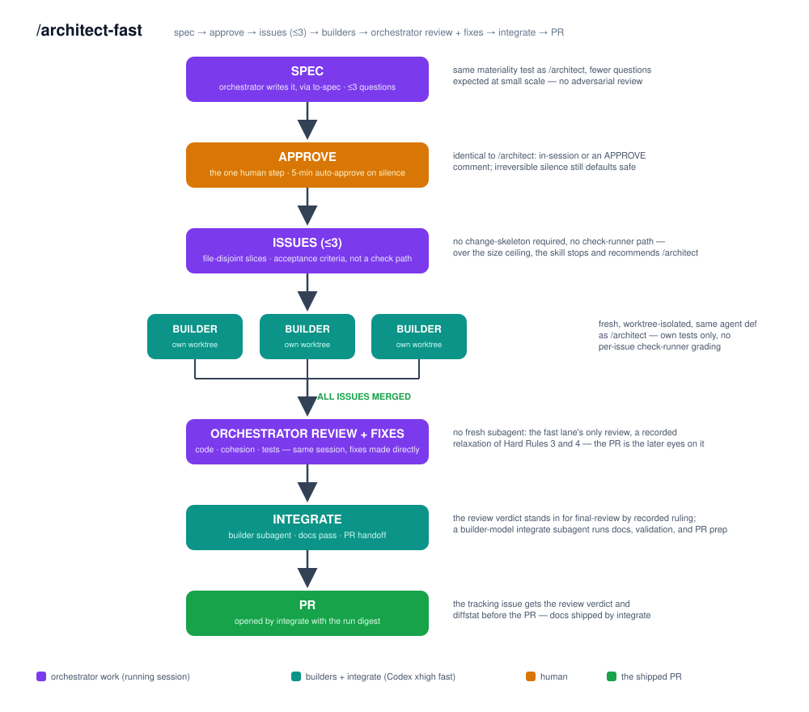

# architect-loop

**An autonomous software factory for Codex and Claude: one orchestrator,
fresh-context strategist and builder agents, deterministic gates,
and a single shipping PR or local finish record — no approval gates,
timed rulings all the way down.**

## Usage

```text
/architect-research <topic>
/architect <hours+ feature/product request>
/architect-fast <small change>
```

- `/architect-research` explores a topic and writes an answer-first report.
- `/architect-fast` ships a small, bounded change through the light lane.
- `/architect` runs the full multi-hour factory. State the goal, then let it work.

## Installation

```bash
git clone https://github.com/DanMcInerney/architect-loop
cd architect-loop && ./install.sh        # Windows: .\install.ps1
npm i -g @openai/codex@latest            # optional builder backend
```

The installer copies the same `skills/` tree to Claude and Codex skill
locations. Use `./install.sh --project` or `.\install.ps1 -Project` to install
into the current repo instead of your user profile.

## What Changed Recently

- The loop is now a small stage-skill library: `codebase-design`, `to-spec`,
  `adversarial-review`, `to-issues`, `frozen-checks`, `tdd`,
  `final-review`, and `integrate`.
- Run identity is pinned by `docs/runs/<run>/manifest.md`; status commands
  take a run slug and no longer discover "the current run" by scanning issues.
- GitHub and markdown tracker modes share the same state machine. Markdown
  issues live in `docs/issues/<run>/` and need no GitHub remote.
- The closing `final-review` is read-only. It returns `REVIEW: GREEN` or a
  review spec plus fix issues; fix issues build through the same builder wave.
- CLI jobs now run through `run-job.ps1|.sh`, which owns heartbeat, exit truth,
  stdout events, stderr logs, sandbox temp/cache redirects, and kill scope.
- The watchdog is typed evidence only. It detects stalls, repeated commands,
  blocked tool calls, orphaned wrappers, failed exits, and legacy unwrapped jobs;
  the orchestrator still decides.
- `kill-job.ps1|.sh` is the explicit reaping action for stuck wrapped jobs.
- The check-runner preserves head, tail, and pytest summaries, and can emit
  progress events for killed or interrupted RUN items.
- Postflight can defer locked worktree cleanup; `sweep-deferred.ps1|.sh <run>`
  clears run-scoped debris before final close.

## Design

The current session is the **orchestrator**. It grounds the repo, dispatches
fresh agents, rules on typed evidence, owns commits, and posts the digest. A
configurable **strategist** subagent handles full-lane design and review work;
fresh **builders** implement exactly one issue each in isolated worktrees and
report raw evidence only. See [DESIGN.md](DESIGN.md) for the evidence trail and
[CONTEXT.md](CONTEXT.md) for the vocabulary.

### /architect


- Intake feeds the goal straight to a fresh strategist that drafts the spec;
  open questions become timed rulings that auto-default into recorded
  assumptions. There is no human approval gate anywhere — the human steers
  by editing the spec, commenting rulings, or `docs/STOP`.
- One fresh harden strategist attacks the draft, folds surviving findings
  into a revised spec, decomposes it into file-disjoint vertical-slice
  issues, drafts frozen checks, and stress-tests its own decomposition.
- The orchestrator publishes the spec and issues to the tracker and owns the
  freeze commit. Checks freeze in git before any builder exists.
- The run manifest pins the tracking issue, tracker mode, factory branch, and
  spec path; every issue carries a run marker.
- Builders run in fresh worktrees. They must state disagreements before coding,
  must not commit, and must end with one raw `STATUS:` line.
- Wrapped CLI jobs write `job.meta.json`, `job.heartbeat`, `job.exit.json`,
  `events.jsonl`, and `stderr.log`; exit truth outranks terminal-looking report
  text. Postflight refuses to merge CLI job work without that wrapper exit
  truth — unwrapped work cannot merge.
- The OS sandbox is deliberately weak (`danger-full-access`): builders may
  use the network and the wider filesystem. The real boundaries are the
  postflight touch-set audit, the never-commit ban, and read-only frozen
  checks.
- The watchdog reports typed evidence only. It never kills, nudges, or grades.
  Stuck jobs are reaped with `kill-job.ps1|.sh` and respawned from durable issue
  context.
- The check-runner grades frozen RUN items with fixed expectations. Postflight
  audits touched files, merges green jobs, and records deferred cleanup if a
  worktree cannot be removed immediately.
- At finish the orchestrator runs the closing test pass — builder-built
  suites plus every frozen RUN item — and feeds the raw output into the
  final review: one fresh, read-only strategist pass over the whole run.
  Findings become fix issues and draft checks for a fix wave; zero findings
  short-circuit to integrate.
- `integrate` is a builder-model stage whose first step is the docs pass. It
  consumes the change-context digest, updates product docs, verifies the closing
  state, sweeps deferred cleanup, and prepares the PR or markdown finish record.

### /architect-fast



- Same front door and tracker semantics as `/architect`, but capped at at most
  three builder issues and roughly 400 changed lines.
- No strategist subagents, no adversarial review, no frozen checks, no
  per-issue check-runner, and no watchdog script. Issue-body acceptance
  criteria, builder-run tests, and the closing builder review carry the gate.
- Each job records its dispatch-head SHA; that SHA is the postflight diff base
  in place of a freeze SHA.
- One per-wave timed fallback wake replaces watchdog monitoring.
- After all issues merge, the orchestrator runs the full test suite and hands
  the output to one fresh builder subagent that reviews code, cohesion, and
  tests, records its findings as one fix issue, and fixes them in its
  worktree; the orchestrator merges, records the verdict and diffstat, then
  dispatches `integrate`.
- If the work exceeds the size ceiling, the lane stops and recommends
  `/architect`.

### /architect-research


- A scout maps brainstorm-scale topics before lanes are designed; quick
  fact-finds skip the scout.
- The orchestrator designs research lanes along the topic's real fault lines.
- Researchers gather in parallel under hard budgets and return compact findings
  tied to numbered sources.
- The draft is marked SUPPORTED / THIN / EMPTY. Thin or empty sections trigger
  up to two targeted gap rounds.
- Verification checks load-bearing claims against raw sources, including
  falsification searches, before one author writes the report.

## Config

Optional config lives at `.architect/config` or `~/.architect/config` (repo
wins; unknown keys warn and do not fail).

```ini
strategist = claude/best       # Fable-class design/review subagents
builders = codex/best          # GPT-5.5 xhigh builders; Fast pins when available
tracker = markdown             # local issue files; omit for GitHub mode
when broad ambiguous refactor -> codex/best:xhigh  # optional builder route
```

Role strings are `<cli>/<model-spec>[:<effort>]`, with `<cli>` `claude` or
`codex`. `best` and `tier-down` resolve per family. The orchestrator is always
the session you opened, never a config key.

Default full-lane routing uses `claude/best` for strategist stages and
`codex/best` for builders. If a configured CLI is missing, the loop records the
substitution on the tracker instead of silently changing behavior. Codex
builders under ChatGPT auth use Fast-mode pins when available; API-key auth
drops those pins with a recorded substitution.

### Tracker Modes

`tracker = github` needs a GitHub remote, authenticated `gh >= 2.94.0`, and push
access. Sub-issues use native parent and blocked-by edges.

`tracker = markdown` needs only a git repo. Issues are git-tracked markdown
files in `docs/issues/<run>/`, with the same parent/blocker semantics, comments,
states, and status tree. The run finishes with a ready factory branch and merge
instructions instead of an auto-opened PR unless the in-session human directs
otherwise.

### Run Artifacts

Versioned run inputs live under `docs/spec/`, `docs/checks/<run>/`, and, in
markdown mode, `docs/issues/<run>/`.

Local run bookkeeping is gitignored: manifests under `docs/runs/<run>/`, job
reports and check evidence under `docs/jobs/<run>/`, wrapper files under
`.architect/jobs/<run>/`, builder worktrees under `.architect/wt/<run>/`, and
temporary sandbox/cache paths under `.architect/tmp/`.

Status is scripted:

```bash
skills/architect/status.sh <run>
```

```powershell
skills\architect\status.ps1 <run>
```

An empty `docs/STOP` file halts every run at the next dispatch boundary. An
empty `docs/runs/<run>/STOP` halts only that run.

## Validation

```bash
uv run --no-project python tests/validate_skills.py
```

The validator checks skill trigger hygiene, sibling-file pointers, README and
DESIGN links, fenced code blocks, runner contracts, wrapper/watchdog fixtures,
and the shipped architectural invariants.

## License

MIT
